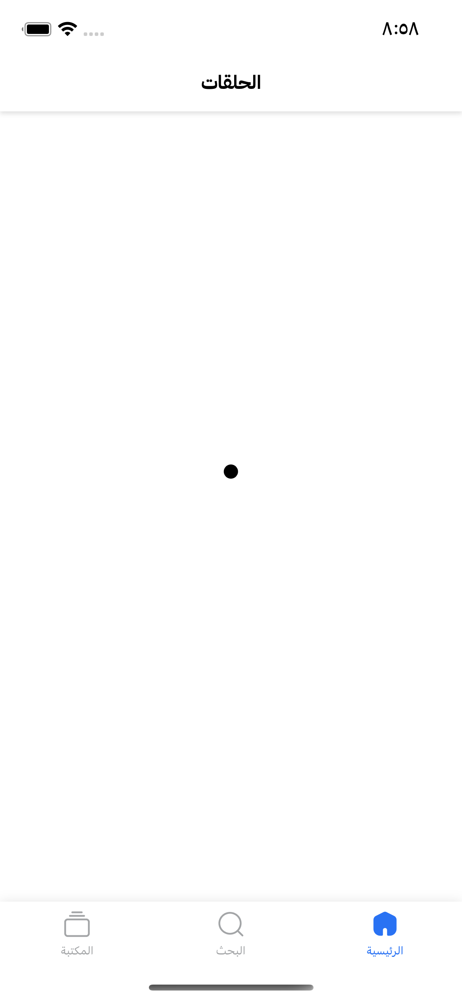
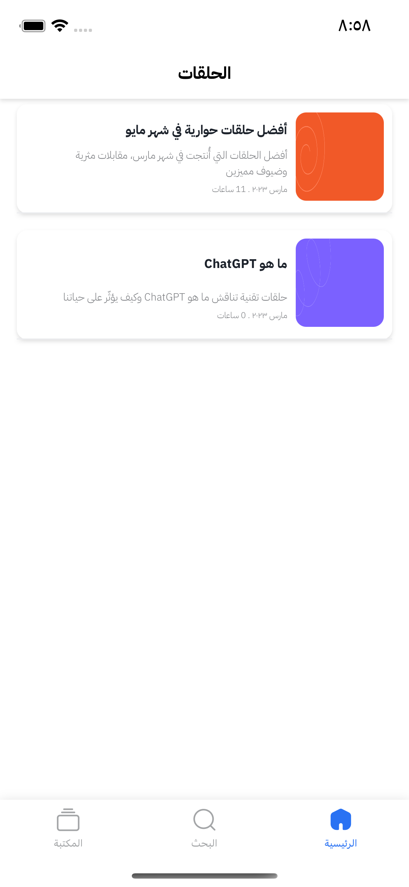
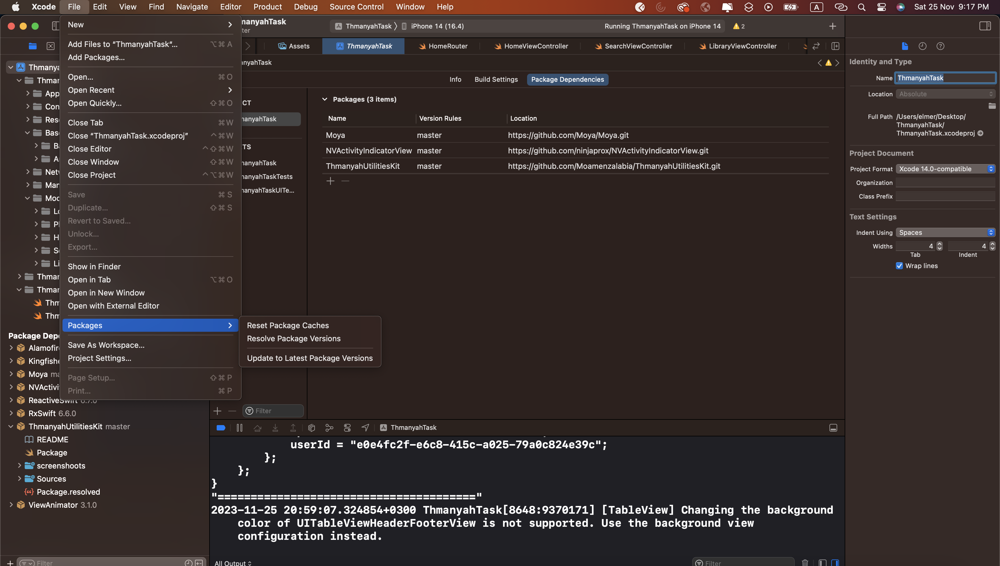

# ThmanyahTask Assignment - iOS Developer 

Assignment Requirement: Create a simple iOS mobile application that:

* The user is presented with a Playlists.
* Create Swift Package.
* Use this api (https://drive.google.com/file/d/1jbFQubSdFsZVXRjQ94cDmVF5dJwu0gL6/view)
* You can Select Playlist to Display it's Episodes.

## Key features: 

* User must be login and using it's accessToken in Api header before showing Playlist.
* Show loading indicator when playlist api is calling.
* Show playlist data after api is called.
* Show error message when problem happened.
* User can select another playlist to display it's episodes.

## Demo

* [Google Drive ](https://drive.google.com/file/d/1ZotME58WrB1X22BQfeuLP-Evy7XfNWDl/view?usp=sharing) 

## Screenshots

| Playlists Loading | Playlists Screen | First Playlist Screen | Second Playlists Screen |
| --- | --- | --- | --- |
|  |  |  |  |


## Tech Stack

*  Swift 5
*  UIKit
*  Moya (networking layer)
*  VIP architecture implement
*  Codable (Object mapping)

## Architecture

Clean Architecture with VIP and MVVM pattern in the presentation layer

## Setup

Download code or clone repo then navigate to code path and open `ThmanyahTask.xcodeproj`  and follow this image.

   

```
Update to Latest Package Versions
```
